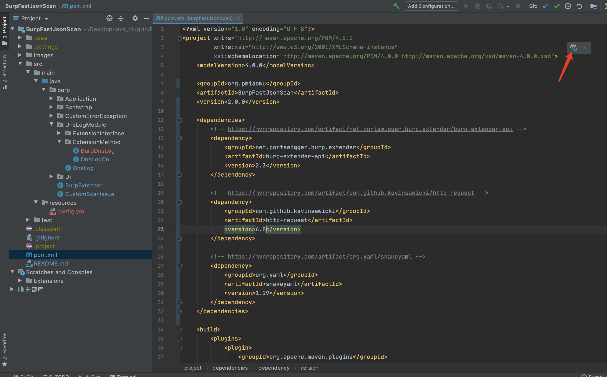
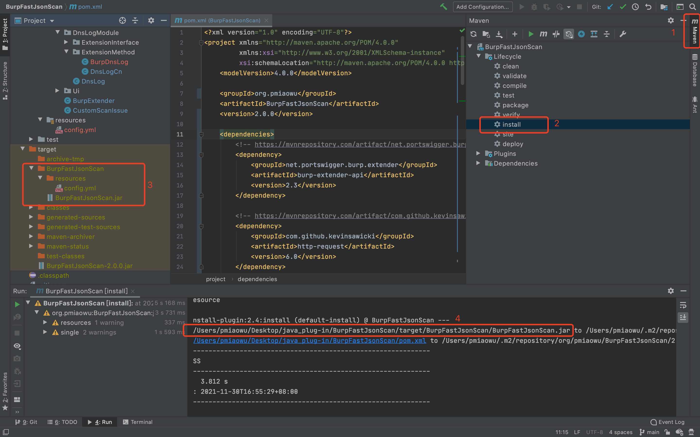
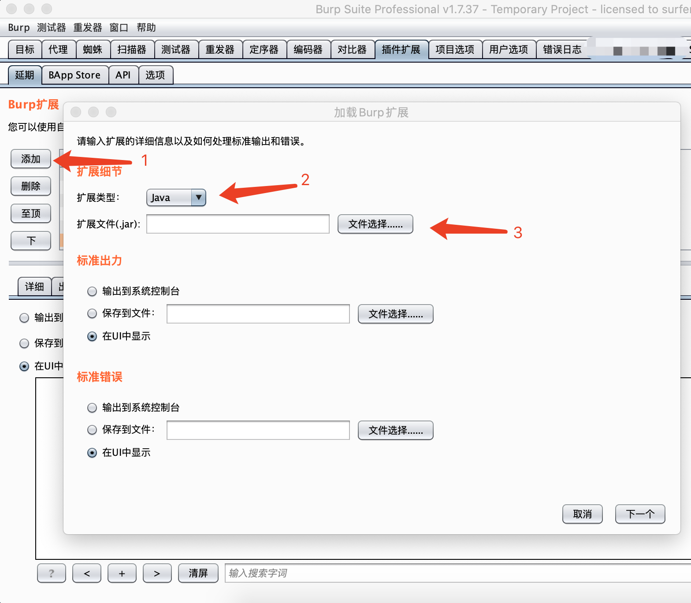
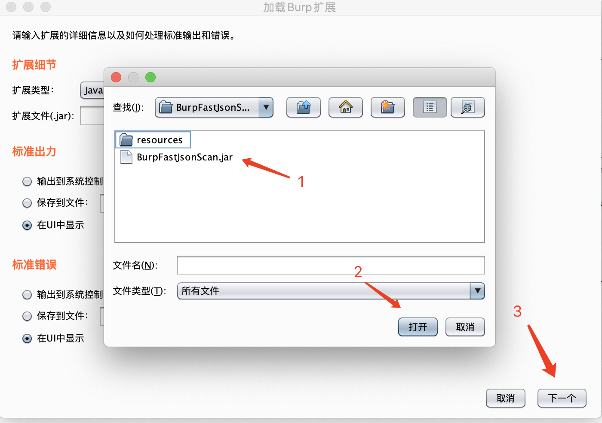
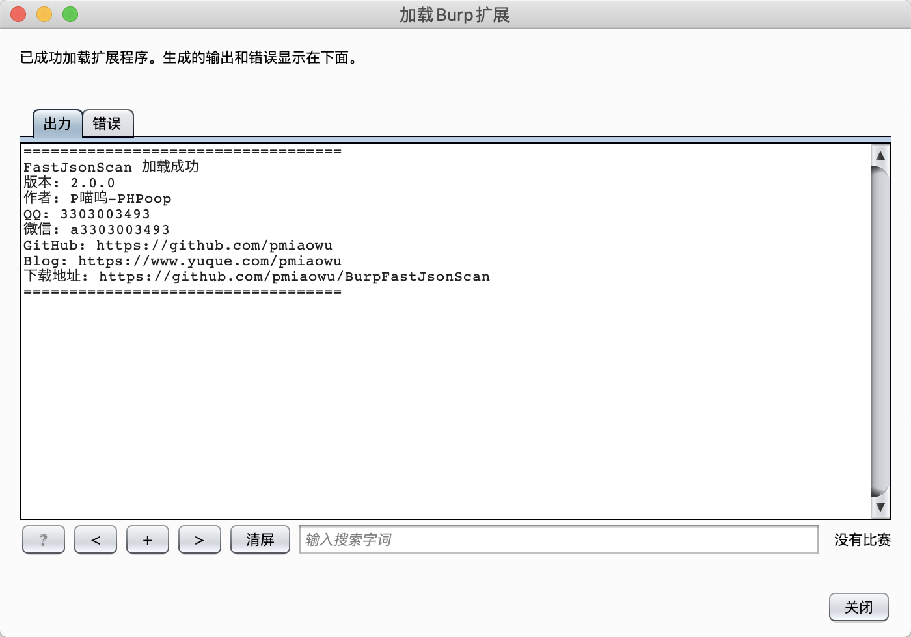
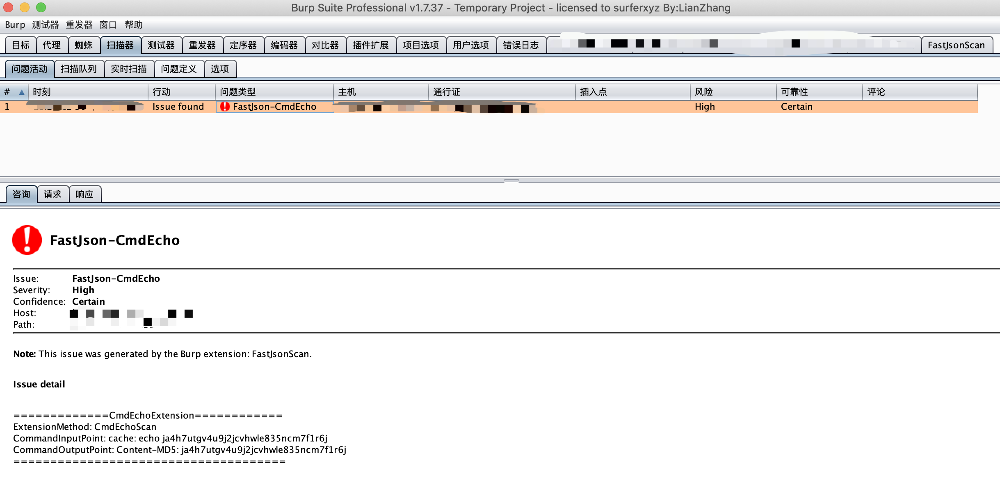
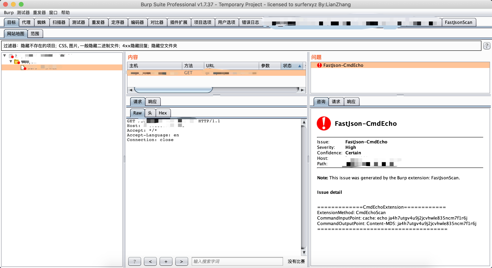
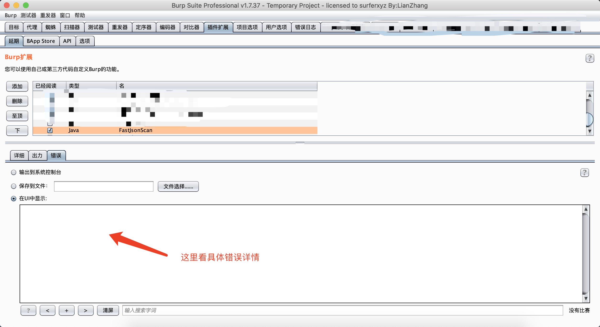
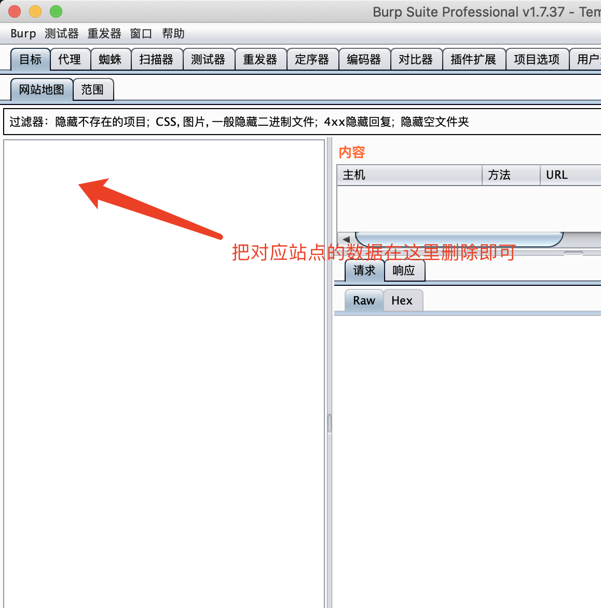

# BurpFastJsonScan
一款基于BurpSuite的被动式FastJson检测插件

# 免责声明
该工具仅用于安全自查检测

由于传播、利用此工具所提供的信息而造成的任何直接或者间接的后果及损失，均由使用者本人负责，作者不为此承担任何责任。

本人拥有对此工具的修改和解释权。未经网络安全部门及相关部门允许，不得善自使用本工具进行任何攻击活动，不得以任何方式将其用于商业目的。

# 简介
BurpFastJsonScan 一个希望能节省一些渗透时间好进行划水的扫描插件

该插件会对BurpSuite传进来的带有json数据的请求包进行检测

目前的功能如下
- 命令回显
- 远程命令执行

# 请注意!!!!
默认使用jdk1.8编译

默认使用jdk1.8编译

默认使用jdk1.8编译

默认使用jdk1.8编译

在最新版的burp2.x中jdk为1x,会导致插件不可用,请自行下载源码使用当前电脑的jdk1x进行编译,谢谢

在最新版的burp2.x中jdk为1x,会导致插件不可用,请自行下载源码使用当前电脑的jdk1x进行编译,谢谢

在最新版的burp2.x中jdk为1x,会导致插件不可用,请自行下载源码使用当前电脑的jdk1x进行编译,谢谢

在最新版的burp2.x中jdk为1x,会导致插件不可用,请自行下载源码使用当前电脑的jdk1x进行编译,谢谢

在最新版的burp2.x中jdk为1x,会导致插件不可用,请自行下载源码使用当前电脑的jdk1x进行编译,谢谢

在最新版的burp2.x中jdk为1x,会导致插件不可用,请自行下载源码使用当前电脑的jdk1x进行编译,谢谢

在最新版的burp2.x中jdk为1x,会导致插件不可用,请自行下载源码使用当前电脑的jdk1x进行编译,谢谢

在最新版的burp2.x中jdk为1x,会导致插件不可用,请自行下载源码使用当前电脑的jdk1x进行编译,谢谢

在最新版的burp2.x中jdk为1x,会导致插件不可用,请自行下载源码使用当前电脑的jdk1x进行编译,谢谢

在最新版的burp2.x中jdk为1x,会导致插件不可用,请自行下载源码使用当前电脑的jdk1x进行编译,谢谢

# 编译方法

<details>
<summary><b>编译方法</b></summary>

这是一个 java maven项目

默认java版本为 1.8

导入idea,打开刚刚好下载好的源码


打开: /BurpFastJsonScan/pom.xml 安装对应的包,第一次安装依赖包需要比较久,慢慢等不要急





编译文件地址: /BurpFastJsonScan/target/BurpFastJsonScan/

jar包地址: /BurpFastJsonScan/target/BurpFastJsonScan/BurpFastJsonScan.jar

项目配置文件地址: /BurpFastJsonScan/target/BurpFastJsonScan/resources/config.yml

接着拿着这个jar包, 导入BurpSuite即可

</details>

# 安装方法
这是一个 java maven项目

如果你想自己编译的话, 那就下载本源码自己编译成 jar包 然后进行导入BurpSuite







# 检测方法选择

目前有二种方法进行的检测
- 命令回显
- 远程命令执行

# 检测规则

- POST 的内容为json
- GET 的参数内容为json
- POST 的参数内容为json
- Cookie 的参数内容为json

```
例子:
GET, POST, Cookie 有个参数 json
json = {"aaa":"66666"}
那么就会去检测
json的这种就是请求包的内容直接就是json不带参数的那种, 也会去检测
```

# 使用方法
我们正常去访问网站, 如果站点的某个请求出现了 json 那么该插件就会去尝试检测

访问完毕以后, 插件就会自动去进行扫描

如果有结果那么插件就会在以下地方显示
- Tag
- Extender
- Scanner-Issue activity

# 问题查看

目前有这几个地方可以查看





# tag界面查看漏洞情况

```
现在可以通过tag界面查看漏洞情况了

分别会返回
- request no json =  请求没有json
- request json no eligible = 请求json不符合条件
- the number of website problems has exceeded = exceeded 超出网站问题的数量
- the number of website scans exceeded = 超出网站可扫描次数
- waiting for test results = 等待测试结果
- [+] found fastJson command execution = 查找到fastJson命令执行
- [-] not found fastJson command execution = 没有查找到fastJson命令执行
- [x] scan task timed out = 扫描任务超时
- [x] unknown error = 未知的错误

当发生 unknown error 的时候,可以尝试在下方中查看错误详情
```



# 疑难杂症解决

假如扫描出问题了,想要重新扫描怎么办?

例如tag一直出现如下问题:
- the number of website problems has exceeded = exceeded 超出网站问题的数量
- the number of website scans exceeded = 超出网站可扫描次数

解决方案:

